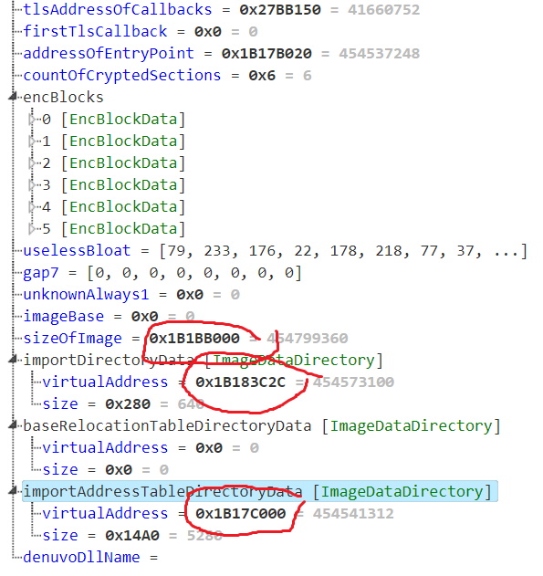
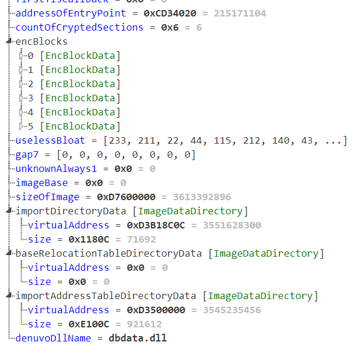
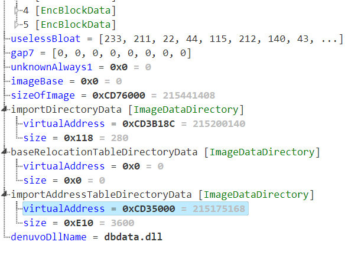

# Origin stub decrypter

An attempt of an origin stub decrypter.
I attempted to fix as many parts of PEs as possible. Unfortunately there are lots of tiny changes between origin stub versions, so creating one decrypter for all is probably impossible. Also it seems like most games require origin running anyways, so decrypting exes is most of the time only useful for modding / inspecting exe purposes.

## Requirements
python 3.9+ with the following packages:
* PyCryptodome
* pefile

## How to use this?
Ideally just run `py decryptOriginStub.py [EXE Name]` and use the [EXE Name].fixed.exe. Unfortunately most of the time it isn't that easy.

## How do I fix this up for other versions of origin
The best way to fix this decrypter for different origin versions is to dump the ooa section of the game, open it with the kaitai script file in the [web editor](https://ide.kaitai.io/)
 and look for very unlikely values. Especially around the end of the file.
I added a few ooa section files of different games as an example. Even small byte alignments can break the decryption.

The current version of the struct works for fifa21 and jfo (and probably bf5 too). The recent release of madden changed some things and old games like bf1 won't work without small fixups either. Most of these fixups are only single byte changes and are very easy to spot

Here is Jedi Fallen Order as an example:

not every value is set but all important values make sense

On the other hand the same struct with Battlefield 1

Everything makes sense until the `sizeOfImage` property. The `sizeOfImage` property of the protected Exe should only slightly differ to unprotected one by about 0x1000 (The size of the added ooa section). Therefore we just change the `unknown_always_1` property to a `u2le` and immediately solve the alignment issue. Now all values past this property start to make sense and the dump will be successful.

As a general rule: make sure that the final property (the denuvo dbdata string) is aligned correctly and you shouldn't run into any issues.

### Disclamer
This doesn't allow you to play games for free. You need to have the game installed and have an active license to decrypt origin stub files.

### Credits
Greets to extern for his initial version of the dumper