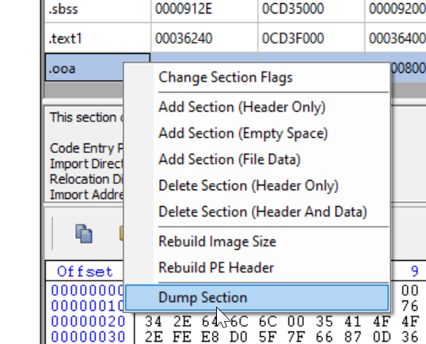

# Origin stub decrypter

This is an attempt of an origin stub decrypter to get clean game dumps without having to resort to runtime dumping.
I attempted to fix as many parts of PEs as possible. Unfortunately there are lots of tiny changes between origin stub versions, so creating one decrypter for all is probably impossible. This is especially useful for modding / analysis purposes.

## Requirements
python 3.9+ with the following packages:
* PyCryptodome
* pefile

## How to use this?
Ideally just run `py decryptOriginStub.py [EXE Name]` and wait a couple of seconds. The resulting file should be `[EXE Name].fixed.exe`. Try to launch the file in x64dbg to check for any errors. If there are some, just continue reading.

## How do I fix this up for other origin stub versions
The easiest way to fix this decrypter for different origin versions is to dump the ooa section of the game, open it with the kaitai script file in the [web editor](https://ide.kaitai.io/)
 and look for very unlikely values. Especially around the end of the file.
I added a few ooa section files of different games in the `sample ooa sections` folder as an example. Even small byte alignment changes break the decryption process and might result in a broken IAT or TLS.

You can dump ooa sections for other games by yourself using CFF explorer or any other PE tool.

The current version of the struct works for fifa21 and jfo (and probably bf5 too). But other games like the recent release of madden changed some things and older games like bf1 won't work without small fixups either. It is unfortunately impossible to guarantee any kind of backwards/forwards compatibility because EA programmers are actively ~~breaking~~ changing things with every new release. Fortunately most of these changes are only a matter of type sizes and alignments and are very easy to spot.

Here is the OOA section of Jedi Fallen Order as an example:

not every value is set but all relevant values make sense.

On the other hand the same struct with Battlefield 1:

Everything makes sense until the `sizeOfImage` property. The `sizeOfImage` property of the protected Exe should only slightly differ to unprotected one by about 0x1000 (The size of the added ooa section). Therefore we just change the `unknown_always_1` property (don't think about the name - i don't know what it is supposed to do and was 1 in all of my test exes) to a `u2le` and immediately solve the alignment issue. Now all values past this property start to make sense and the dump will be successful.

As a general rule: make sure that the final property (the denuvo dbdata string) is aligned correctly and you shouldn't run into any issues.

### Disclamer
This is not a "crack" and doesn't allow you to play games for free. You need to have the game installed and have an active license to get the required origin stub decryption key to use this program.

### Credits
Greets to Extern for his initial version of the dumper